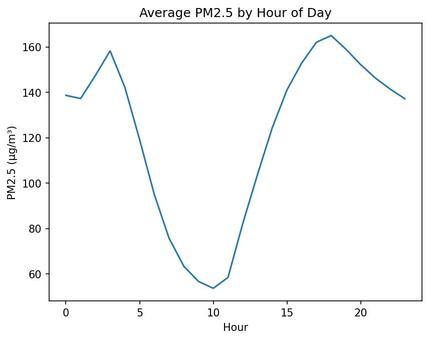
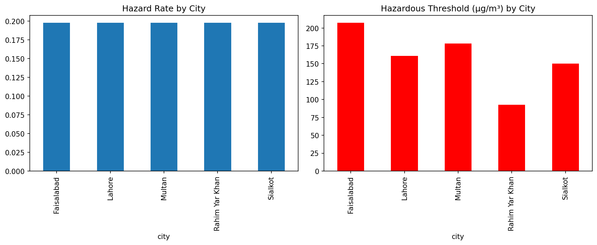
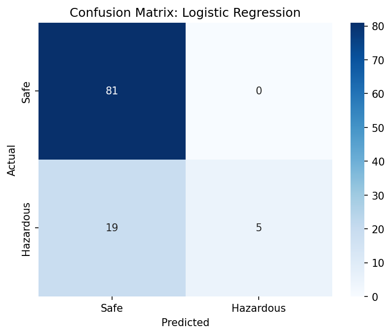

# Predicting Hazardous Air Quality Days in Punjab, Pakistan

## Problem Statement
Can daily weather conditions (temperature, humidity, precipitation, wind speed, and pressure) predict whether a given day will have hazardous air quality in major Punjab cities, in order to support early-warning and prevention efforts?

## Motivation
Lahore and other cities in Punjab, Pakistan, rank among the most polluted urban areas in the world, particularly during winter smog season. Early, weather-based warnings could help residents make informed decisions about outdoor activity and health precautions before pollution reaches dangerous levels. This project explores whether commonly available weather data alone is enough to flag high-risk days across five Punjab cities: Faisalabad, Lahore, Multan, Rahim Yar Khan, and Sialkot.

## Dataset
- **Source:** [Pakistan Air Quality & Weather](https://www.kaggle.com/datasets/ahsanneural/pakistan-air-quality-and-weather-10-cities/) by Muhammad Ahsan, Kaggle (CC0 license)
- **Scope:** Hourly air quality and weather readings, November 2025 to February 2026, across 10 major Pakistani cities (this project uses 5: Faisalabad, Lahore, Multan, Rahim Yar Khan, Sialkot)
- **Size:** 21,840 hourly records (full dataset), aggregated to 455 daily city-records for this analysis
- **Note:** After this analysis was completed, the dataset maintainer resolved a data quality issue that had been flagged during this project (see Limitations). This analysis was conducted on the original, unfixed version of the dataset.

## Methodology

### Data Aggregation
The original dataset is hourly. For this project, data was aggregated to daily granularity per city, since the research question focuses on day-level prediction. Weather features were aggregated using the daily mean; the target variable (PM2.5) was also aggregated to a daily mean before applying the hazard threshold.

During this process, weather variables were found to be constant across all 24 hours for a 21-day window per city (Nov 6-26, 2025), likely indicating daily-resolution backfill before hourly logging began. Since the values were physically plausible and the target variable (PM2.5) retained genuine hourly variation throughout, these days were retained in the final daily-aggregated dataset (see Limitations for more detail).

### Target Variable
"Hazardous" is defined using a per-city relative threshold: the 80th percentile of each city's own daily mean PM2.5 distribution. This approach was chosen after finding that a single threshold shared across all 5 cities produced zero hazardous days for Rahim Yar Khan, since its pollution levels are consistently lower than the other cities. Per-city thresholds ensure every city has a meaningful, comparable proportion of hazardous days (~20% each), though this means the *rate* of hazardous days is not directly comparable to absolute pollution severity across cities (see Limitations).

| City | Hazard Threshold (µg/m³) |
|---|---|
| Faisalabad | 207.5 |
| Multan | 178.5 |
| Lahore | 161.0 |
| Sialkot | 150.1 |
| Rahim Yar Khan | 92.7 |

### Feature Selection
Features were selected based on the principle of avoiding data leakage: only variables that represent independent, upstream conditions (weather) were included, while variables that are symptoms of the same pollution event as the target were excluded.

**Included:** temperature, humidity, precipitation, wind_speed, pressure, city (categorical), is_weekend

**Excluded:**
- `pm10, carbon_monoxide, nitrogen_dioxide, sulphur_dioxide, ozone, dust, aqi_category` — other pollutant measurements, entangled with the target rather than independent of it
- `latitude, longitude` — redundant with city (each city maps to exactly one coordinate pair)
- `hour` — meaningless after daily aggregation
- `year` — risk of the model keying off calendar year rather than learning generalizable weather relationships
- `month, month_name` — redundant with season
- `season` — dropped after discovering the test set fell entirely within one season (Winter), making this feature unusable for evaluation (see Limitations)
- `day_of_week` — redundant with is_weekend for this analysis
- `wind_direction` — excluded from this version, since raw compass degrees can't be meaningfully averaged (circular variable); logged as a future improvement

### Train/Test Split
A date-based split was used rather than a random split, to avoid leakage from highly correlated adjacent days (weather conditions on consecutive days are similar, so a random split risks the model implicitly "seeing" information from days adjacent to its test set). The dataset was split at January 15, 2026, giving roughly an 80/20 train/test split by day count. Because hazardous episodes cluster in specific windows within this short 3-month dataset, train and test hazard rates differ slightly (18.9% vs 22.9%) despite selecting a broadly representative cutoff date.

## EDA Highlights

### Bimodal Daily Pollution Pattern
Hourly analysis revealed that PM2.5 shows two daily peaks rather than one: around 6 PM and again around 3 AM (pre-dawn), with a trough around 10 AM. The evening peak likely reflects heavy vehicle emissions during rush hour. The pre-dawn peak likely reflects a temperature inversion, where cold air near the ground gets trapped beneath a warmer layer above, preventing pollutants from dispersing. The mid-morning trough occurs as the sun warms the ground, breaking the inversion and allowing pollution to disperse.



### Precipitation and Hazard Status
Every one of the 91 hazardous days in the dataset had zero precipitation, compared to only 8.2% of safe days having any rain at all. Given the overall base rate of rain (roughly 8% of all days), the expected number of hazardous days with rain by chance alone would be approximately 7-8 — the observed count of 0 suggests a real, non-coincidental relationship between rainfall and cleaner air, consistent with rain physically washing particulates out of the atmosphere.

### City-Level Severity Comparison
While each city's hazard *rate* is approximately 20% by construction (per-city relative thresholds), the absolute severity differs sharply. Faisalabad's hazard threshold (207.5 µg/m³) is more than double Rahim Yar Khan's (92.7 µg/m³), reflecting genuinely different baseline pollution levels across Punjab despite similar relative hazard rates.



### Weather Feature Separation
Boxplot comparisons of weather variables across hazardous vs. safe days showed wind speed and humidity as the features with the clearest separation between classes (low wind speed and high humidity both associated with hazardous days), while pressure showed minimal separation on its own — though it was retained as a feature, since single-variable comparisons cannot rule out its usefulness in combination with other features.

## Models

Five models were trained and compared:

1. **Baseline (majority class):** always predicts "safe," used to establish the minimum bar any real model must beat
2. **Logistic Regression:** chosen as a first model for its interpretability — coefficients give both direction and relative strength of each feature's effect, which supports this project's goal of understanding *why* a day is predicted hazardous, not just whether
3. **Logistic Regression (class-weighted):** re-trained with `class_weight='balanced'` to address class imbalance
4. **Random Forest:** chosen to test whether capturing feature interactions (e.g., low wind speed combined with high humidity) would improve on Logistic Regression's single linear decision boundary
5. **Random Forest (class-weighted):** re-trained with `class_weight='balanced'`
6. **Gradient Boosting:** a second tree-based ensemble method, trained to confirm whether the pattern seen in Random Forest held across a different tree-based approach

All models used the same feature set. Logistic Regression required feature scaling (StandardScaler, fit on training data only); tree-based models did not.

## Evaluation

Given the class imbalance (~20% hazardous days) and the real-world cost of missing a hazardous day, accuracy alone was treated as an insufficient metric. Precision, recall, and F1-score on the hazardous class were prioritized, since recall specifically measures the model's ability to catch real hazardous days (avoiding false negatives), which is the core goal of an early-warning system.

| Model | Accuracy | Precision | Recall | F1 |
|---|---|---|---|---|
| Baseline (always "safe") | 77.1% | — | 0% | — |
| Logistic Regression | 81.9% | 1.00 | 20.8% | 0.34 |
| Logistic Regression (weighted) | 69.5% | 0.30 | 25.0% | 0.27 |
| Random Forest | 81.0% | 1.00 | 16.7% | 0.29 |
| Random Forest (weighted) | 81.0% | 1.00 | 16.7% | 0.29 |
| Gradient Boosting | 79.0% | 0.67 | 16.7% | 0.27 |



### Key Finding: Class Weighting Had Divergent Effects
Class weighting meaningfully changed Logistic Regression's behavior (recall rose from 20.8% to 25%, but precision collapsed from 1.00 to 0.30) but had **zero effect** on Random Forest (identical results before and after). This divergence supports the hypothesis that Random Forest's limited recall stems from an insufficient number of hazardous training examples (~66 in training) rather than a class-imbalance weighting issue — reweighting importance cannot create patterns that don't have enough data to be found. Gradient Boosting, a third and different tree-based method, plateaued at the same recall ceiling (16.7%) as Random Forest, further supporting this conclusion.

### Selected Model: Logistic Regression (unweighted)
Despite being the simplest model tested, unweighted Logistic Regression was selected as the best-performing option. While the weighted version achieved marginally higher recall, its precision of 0.30 means 70% of its hazardous warnings would be false alarms — a failure mode that would erode public trust in a real early-warning system and ultimately undermine the system's purpose, regardless of the recall improvement. The unweighted model's perfect precision (no false alarms) combined with its still-limited but comparatively better recall (20.8%, catching 5 of 24 hazardous days) represents the more defensible tradeoff for this specific use case.

## Results / Key Findings

### Feature Importance (Logistic Regression Coefficients)

Since features were scaled before training, coefficients are directly comparable in terms of relative effect size.

| Feature | Coefficient | Direction |
|---|---|---|
| Humidity | +1.475 | Higher humidity → higher hazard likelihood |
| City: Rahim Yar Khan | +0.649 | See discussion below |
| City: Multan | +0.341 | Higher hazard likelihood vs. Faisalabad (reference city) |
| Pressure | +0.283 | Higher pressure → higher hazard likelihood |
| City: Lahore | +0.033 | Roughly neutral vs. Faisalabad |
| Temperature | -0.038 | Weak effect |
| City: Sialkot | -0.149 | Lower hazard likelihood vs. Faisalabad |
| is_weekend | -0.226 | Weekdays associated with higher hazard likelihood |
| Wind speed | -0.292 | Higher wind speed → lower hazard likelihood |
| Precipitation | -0.730 | Any rainfall strongly associated with lower hazard likelihood |

These directions are consistent with the EDA findings above: humidity and precipitation showed the same relationships in boxplot comparisons and the precipitation deep-dive, and wind speed's negative coefficient matches its physical role in dispersing pollutants.

### The City Coefficient Puzzle
City coefficients are relative to Faisalabad (the reference category). Notably, Rahim Yar Khan shows one of the *highest* positive coefficients, despite having the *lowest* absolute pollution severity of all five cities (threshold of 92.7 µg/m³ vs. Faisalabad's 207.5 µg/m³).

This is not a contradiction: since "hazardous" is defined relative to each city's own threshold, the coefficient reflects how weather-sensitive each city's *relative* bad days are, not absolute severity. Rahim Yar Khan's lower threshold may be more directly reachable through weather conditions alone, while Faisalabad's much higher threshold may require additional factors beyond weather (e.g., traffic or industrial activity) that this model does not capture. This finding is consistent with the decision to exclude other pollutant readings as features (to avoid leakage) — it suggests Faisalabad's most severe pollution days may be driven by sources this model cannot see.

## Error Analysis

In evaluating the results, I found that the model missed 19 hazardous days, nearly all clustered within a single window (Jan 15-21, 2026), predicting them as "safe" when they were actually hazardous. This is a serious error for a project meant to support early-warning and prevention. Error analysis revealed that these missed days were not borderline cases; several had PM2.5 levels well above their city's threshold, and the weather data (particularly high humidity, the strongest predictor in the model) still pointed toward "hazardous." The likely explanation is that real smog episodes build up gradually over consecutive days, but this model treats each day independently, with no memory of recent conditions or trend. As a result, it cannot recognize when pollution has been accumulating over several days, even when a single day's weather conditions strongly suggest risk. A promising future improvement would be to add features that capture recent trend or persistence, such as the previous day's PM2.5 level or a rolling average over the past few days, giving the model some awareness of ongoing pollution buildup rather than treating every day in isolation.

Following feedback from the dataset maintainer, I explored adjusting the classification threshold below the default 0.5 as an alternative way to improve recall, without training a new model. At threshold 0.3, recall improved from 20.8% to 25% (catching 6 of 24 hazardous days instead of 5), but precision dropped from a perfect 1.0 to 0.67, meaning roughly 1 in 3 hazardous warnings would be a false alarm. After weighing this tradeoff, I chose to keep the default threshold (0.5) as the primary model. My reasoning: for an early-warning system, the trustworthiness of every individual warning matters as much as the raw number of hazardous days caught, since a system that gives false alarms too often risks eroding user trust and being ignored over time, defeating its purpose regardless of its recall. This remains a genuine, debatable tradeoff rather than a clear-cut answer, and a lower threshold could be reconsidered if false alarms were judged to be an acceptable cost in a real deployment.

## Limitations

**Limited hazardous examples.** The dataset had a limited number of hazardous examples: approximately 66 hazardous days out of 455 total city-days (roughly 91 days across each of the 5 cities). This mattered because more complex models (Random Forest, Gradient Boosting) could not find reliable patterns from so few positive examples, and instead defaulted toward conservative, majority-class-leaning predictions. As a result, the exact recall percentages reported here should not be assumed to hold on a larger or different dataset — the more reliable finding is the general pattern that complex models struggled more than simpler ones under this data constraint, not the precise recall numbers themselves.

**Short time range, single season.** The dataset spans approximately 3 months (November 2025 to February 2026), covering only Autumn and Winter. This means no claims can be made about long-term or annual trends, since no summer or monsoon data is available. However, this window does cover peak smog season, which remains the most relevant period for this project's research question.

**Per-city relative thresholds.** A single hazard threshold across all 5 cities was tested first, but this proved faulty: Rahim Yar Khan had zero hazardous days under this definition, since it never reached the combined threshold. This led to a per-city relative threshold approach instead, where "hazardous" is defined as each city's own worst 20% of days. However, this means the hazard rate alone can be misleading when comparing cities: a hazard rate of about 20% doesn't reflect how severe the pollution actually is, since a hazardous day in Rahim Yar Khan (threshold ~93 µg/m³) is far less severe than a hazardous day in Faisalabad (threshold ~207 µg/m³), even though both cities show a similar hazard rate under this per-city definition. Anyone comparing pollution severity across cities should refer to the actual threshold values in µg/m³, not just the hazard rate.

**Flat weather readings for a 21-day window.** For 21 days per city (Nov 6-26, 2025), weather variables were found to be constant across all 24 hours, likely indicating daily-resolution backfill before hourly logging began. Since values were physically plausible and the target variable (PM2.5) retained genuine hourly variation throughout, these days were retained in the daily-aggregated dataset. Anyone extending this work to hourly-level prediction should be cautious about this specific 21-day window, since the weather values during that period do not reflect true hourly measurements.

**Weather-only feature scope.** This project relies only on weather variables (temperature, humidity, precipitation, wind speed, and pressure) as predictors. It does not include other real-world contributors to pollution, such as traffic volume, industrial or factory emissions, or crop burning activity, which are known to significantly affect air quality in Punjab. This is a genuine scope limitation: a model built only on weather can only ever explain the portion of pollution variation that weather actually drives, and may perform worse in cities or periods where non-weather sources play a larger role.

**Dataset updated after analysis.** After this analysis was completed, the dataset maintainer resolved the data quality issue described above (the 21-day flat-weather window). This analysis was conducted on the original, unfixed version of the dataset. A valuable future iteration of this project would be to re-run the full pipeline on the corrected dataset and compare results.

**Correlation, not causation.** Low wind speed is strongly associated with hazardous days in this model, but this may reflect wind speed as an indicator of calm, stagnant atmospheric conditions (which trap pollution) rather than wind speed directly causing pollution buildup. This distinction doesn't reduce the model's usefulness for prediction, but it means causal conclusions should not be drawn from these relationships.

**Distribution shift between train and test.** Because the test set (Jan 15 onward) is entirely Winter, while the training set includes both Autumn and Winter, the model was tested on somewhat different weather conditions than it was trained on. This is a separate issue from dropping the season feature earlier, and it's a real limitation of working with a dataset that only spans one short window of time.

## Future Improvements

- **Re-run on the corrected dataset**, now that the dataset maintainer has fixed the flat-weather-readings issue, and compare results to this analysis
- **Incorporate wind direction** using circular statistics or directional bucketing, rather than excluding it entirely
- **Add day-of-week granularity** instead of the binary is_weekend feature, to test whether specific days show different patterns
- **Include non-weather features** (traffic data, industrial zone proximity, crop-burning activity) where available, to test whether they explain the pollution variation weather alone cannot, particularly for cities like Faisalabad
- **Extend to a longer time range**, covering multiple years and all seasons, to enable trend analysis and reduce the small-sample limitations on the hazardous class
- **Explore hourly-level prediction** as a complement to the daily model, now that a bimodal hourly pollution pattern has been identified
- **Add trend/persistence features** (e.g., previous day's PM2.5, or a rolling average over recent days), based on error analysis showing the model consistently misses multi-day smog episodes since it currently treats each day independently


## How to Run This Project

1. Clone this repository
2. Install dependencies: `pip install -r requirements.txt`
3. Download the dataset from [Kaggle](https://www.kaggle.com/datasets/ahsanneural/pakistan-air-quality-and-weather-10-cities) and place it in `data/raw/`
4. Open `notebooks/01_data_exploration.ipynb` in Jupyter or VS Code
5. Run cells sequentially from top to bottom

## Project Structure
\```
lahore-smog-prediction/
├── data/
│   ├── raw/          # original dataset (not tracked in git)
│   └── processed/    # cleaned/aggregated data
├── notebooks/         # analysis notebooks
├── figures/           # saved visualizations
├── README.md
├── requirements.txt
└── .gitignore
\```

